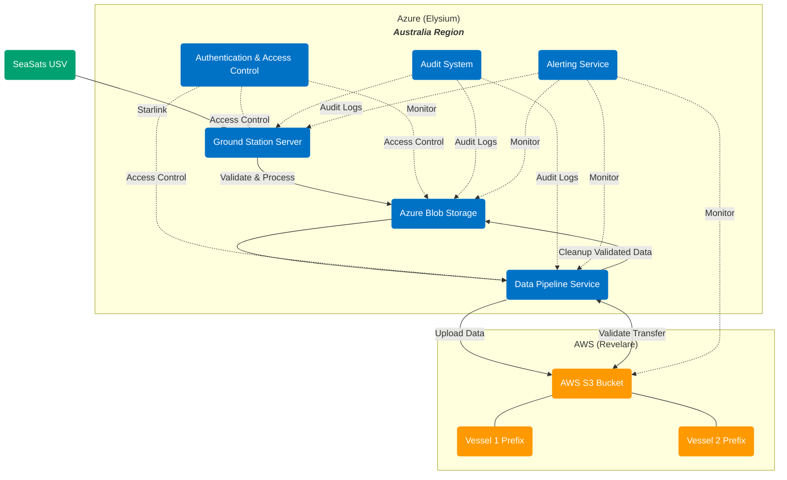
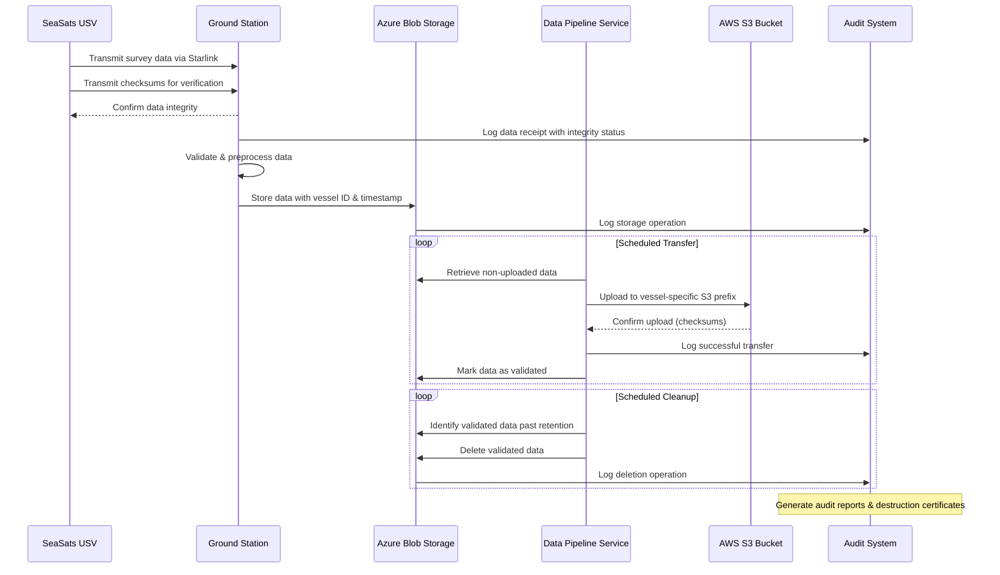

# Elysium USV Data Pipeline

## Overview
This project implements a secure data pipeline for transferring survey data captured by Unmanned Surface Vehicles (USVs) from SeaSats to Revelare. The system ensures data sovereignty, security, and proper data handling according to Australian defense requirements.

## Architecture
The pipeline architecture connects SeaSats USVs via Starlink to an Azure-hosted ground station in Australia, then securely transfers validated data to Revelare's AWS S3 buckets.

### System Architecture Diagram



### Data Flow Sequence



## Key Components

1. **Data Collection Layer**
   - SeaSats USV collecting survey data
   - Starlink satellite communication

2. **Azure Infrastructure (Australia Region)**
   - Ground Station Server for receiving USV data
   - Azure Blob Storage for temporary data storage
   - Data Pipeline Service for validation and transfer
   - Authentication and Access Control with geo-locking

3. **AWS Integration**
   - S3 Transfer Service with vessel-specific credentials
   - Validation and cleanup processes

4. **Monitoring and Compliance**
   - Comprehensive audit system
   - Alerting service for operational monitoring

## Requirements Satisfied

- ✅ Direct upload to Revelare's AWS S3 bucket at regular intervals
- ✅ Dedicated key/secret per vessel with limited permissions
- ✅ Data retention until validated in Revelare's S3
- ✅ Scheduled removal of validated data
- ✅ Audit capabilities for data destruction certification
- ✅ Australia data sovereignty with geo-locking and access controls

## Implementation Notes

This repository contains the code and configuration for implementing the complete data pipeline, including:

- Azure infrastructure as code (ARM templates)
- Data pipeline services and validation logic
- AWS S3 integration components
- Monitoring and auditing tools
- Documentation and operational guides

## Go Implementation Architecture

After assessing the requirements and initial prototyping, we have pivoted to using a robust Go-based monolithic service to implement the data pipeline. This decision was made based on considerations of simplicity, maintainability, and deployment stability.

### Key Components:
- **Worker Pattern Implementation**: Background processing using dedicated workers for each stage
- **FTP Worker**: Monitors an FTP server for data files with MD5 hash companions
- **Validation Worker**: Processes blobs for checksum validation and metadata updates
- **Transfer Worker**: Handles secure transfer of validated data to AWS S3 with verification
- **Cleanup Worker**: Manages data retention and certified data destruction
- **HTTP Server**: Provides health endpoints and operation status
- **Azure Clients**: Integration with Azure Blob Storage and Queue Storage
- **AWS S3 Client**: Secure integration with AWS S3 with MinIO compatibility for testing
- **File-based Audit System**: Records operations for compliance and security

## Development & Deployment

### Prerequisites
- Azure CLI installed and authenticated
- Azure subscription with permissions to create resources
- Access to AWS account for S3 bucket (for production)

### Local Development Setup
1. Install Go 1.21+ and required dependencies:
   ```
   go mod download
   ```

2. Set up a local development environment using Docker:
   ```
   cd tools
   ./local-dev.sh setup
   ```
   
   This script sets up:
   - Azurite for Azure Storage emulation
   - MinIO for S3 emulation
   - Creates necessary containers, queues, and buckets

3. For local testing, the environment variables are automatically set by the local-dev.sh script:
   ```
   ./local-dev.sh run
   ```

### Testing with Mock Data
Use the upload test data script to simulate USV data in the pipeline:

```bash
cd tools
./upload-test-data.sh
```

This script:
- Generates test data files for multiple vessels
- Calculates SHA256 checksums for validation
- Uploads files to Azure Blob Storage with proper metadata
- Adds messages to the validation queue for processing
- Includes a test file with an invalid checksum for validation testing

### Testing with FTP Data
To test the FTP data source functionality:

```bash
cd tools
./prepare-ftp-test-data.sh
```

This script:
- Creates test data files with vessel IDs in different formats
- Calculates MD5 checksums for each file
- Starts the local FTP server with Docker
- Uploads test data to the FTP server
- The FTP worker will then:
  - Connect to the FTP server
  - Download data files and their MD5 hash companions
  - Validate the files using MD5 checksums
  - Upload valid files to Azure Blob Storage
  - Queue them for further validation

### Deployment
Deploy to Azure App Service using the following steps:

```bash
# Build for Linux
GOOS=linux GOARCH=amd64 go build -o bin/pipeline cmd/usvpipeline/main.go

# Create an Azure App Service Plan (if not already created)
az appservice plan create --name elysium-usv-plan --resource-group your-resource-group --sku B1 --is-linux

# Create an Azure Web App
az webapp create --name elysium-usv-pipeline --resource-group your-resource-group --plan elysium-usv-plan --runtime "GO|1.21"

# Deploy the application
zip -r app.zip bin/ configs/
az webapp deployment source config-zip --resource-group your-resource-group --name elysium-usv-pipeline --src app.zip

# Configure environment variables
az webapp config appsettings set --resource-group your-resource-group --name elysium-usv-pipeline --settings \
  AZURE_STORAGE_CONNECTION_STRING="your_azure_storage_connection" \
  AWS_ACCESS_KEY_ID="your_aws_access_key" \
  AWS_SECRET_ACCESS_KEY="your_aws_secret_key" \
  AWS_REGION="ap-southeast-2" \
  AWS_BUCKET_NAME="revelare-vessel-data" \
  ENVIRONMENT="production" \
  FTP_WATCH_ENABLED="true" \
  FTP_HOST="your_ftp_server" \
  FTP_PORT="21" \
  FTP_USER="your_ftp_user" \
  FTP_PASSWORD="your_ftp_password" \
  FTP_WATCH_DIR="/path/to/watch/directory" \
  FTP_POLL_INTERVAL="60s"
```

Note: For production deployments, consider using Azure Key Vault for secret management instead of environment variables.

## Monitoring & Maintenance

- Access health endpoints on `/health` for service availability
- View detailed status on `/api/v1/status` for worker state and processing metrics
- Get worker information via `/api/v1/workers` endpoint
- Check metrics via `/metrics` endpoint
- Audit logs are stored as JSON files for compliance records
- Configure logging verbosity with the `LOG_LEVEL` environment variable

## HTTP API Endpoints

The service exposes the following endpoints:

- `GET /health` - Health check endpoint (returns 200 if healthy, 503 if unhealthy)
- `GET /version` - Returns the current version of the service
- `GET /metrics` - Returns operational metrics
- `GET /api/v1/status` - Returns detailed pipeline status
- `GET /api/v1/workers` - Returns detailed worker status