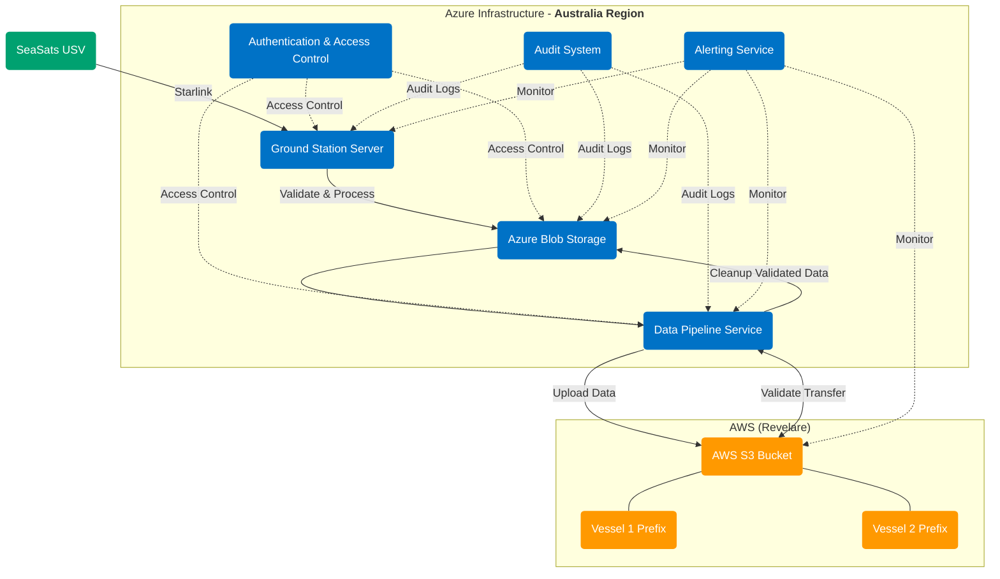
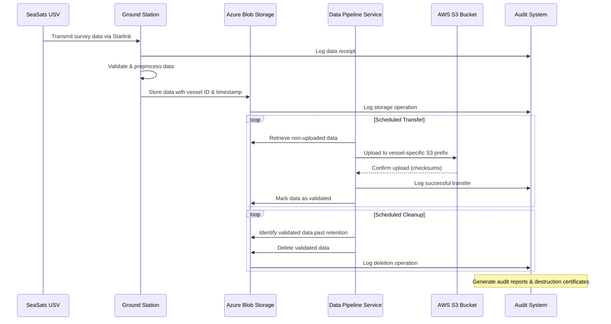

# Elysium USV Data Pipeline

## Overview
This project implements a secure data pipeline for transferring survey data captured by Unmanned Surface Vehicles (USVs) from SeaSats to Revelare. The system ensures data sovereignty, security, and proper data handling according to Australian defense requirements.

## Architecture
The pipeline architecture connects SeaSats USVs via Starlink to an Azure-hosted ground station in Australia, then securely transfers validated data to Revelare's AWS S3 buckets.

### System Architecture Diagram

### Data Flow Sequence

## Key Components

1. **Data Collection Layer**
   - SeaSats USV collecting survey data
   - Starlink satellite communication

2. **Azure Infrastructure (Australia Region)**
   - Ground Station Server for receiving USV data
   - Azure Blob Storage for temporary data storage
   - Data Pipeline Service for validation and transfer
   - Authentication and Access Control with geo-locking

3. **AWS Integration**
   - S3 Transfer Service with vessel-specific credentials
   - Validation and cleanup processes

4. **Monitoring and Compliance**
   - Comprehensive audit system
   - Alerting service for operational monitoring

## Requirements Satisfied

- ✅ Direct upload to Revelare's AWS S3 bucket at regular intervals
- ✅ Dedicated key/secret per vessel with limited permissions
- ✅ Data retention until validated in Revelare's S3
- ✅ Scheduled removal of validated data
- ✅ Audit capabilities for data destruction certification
- ✅ Australia data sovereignty with geo-locking and access controls

## Implementation Notes

This repository contains the code and configuration for implementing the complete data pipeline, including:

- Azure infrastructure as code (Terraform/ARM templates)
- Data pipeline services and validation logic
- AWS S3 integration components
- Monitoring and auditing tools
- Documentation and operational guides