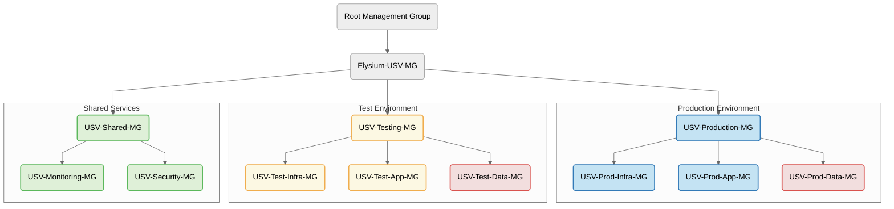
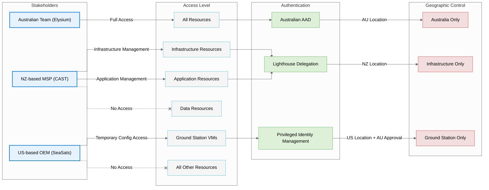
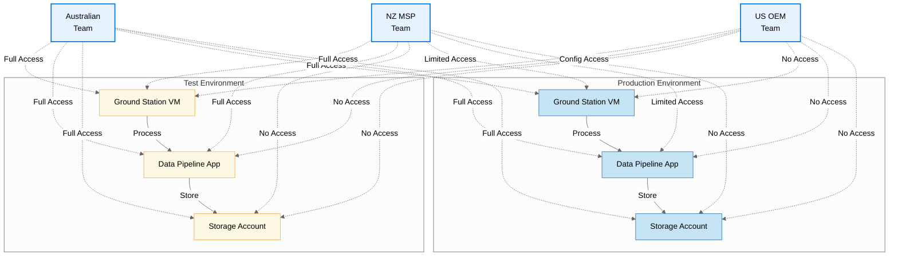
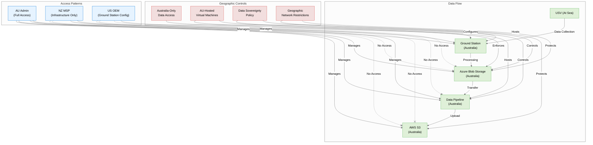
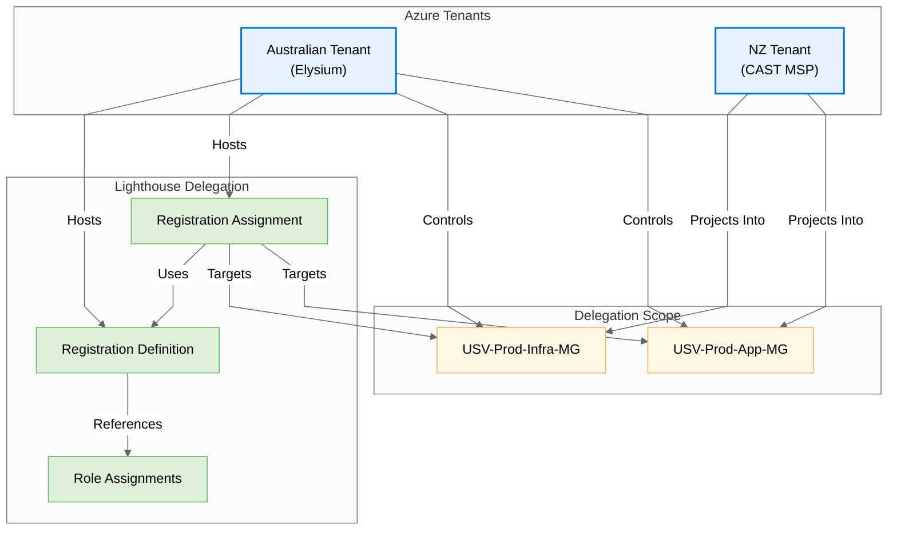
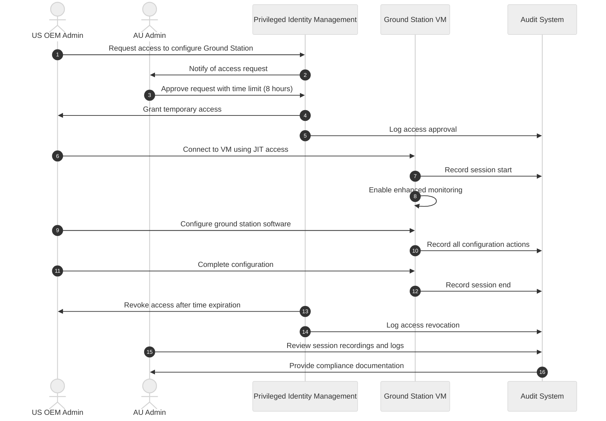

# USV Pipeline Management Model Diagrams

The following diagrams illustrate the comprehensive management model for the Elysium USV Data Pipeline, showing the management group hierarchy, stakeholder access model, and workflow patterns.

## Management Group Hierarchy

## Multi-Stakeholder Access Model

## Resource Type Access by Role

```mermaid
%%{init: {'theme': 'neutral'}}%%
graph TD
    subgraph "Resource Types"
        VM["Virtual Machines"]
        APP["App Services"]
        STORAGE["Storage Accounts"]
        NETWORK["Networking"]
        KV["Key Vault"]
        MONITOR["Monitoring"]
    end
    
    subgraph "Stakeholder Roles"
        AU_ADMIN["AU Admin"]
        NZ_INFRA["NZ Infrastructure Admin"]
        NZ_APP["NZ App Admin"]
        US_GROUND["US Ground Station Admin"]
    end
    
    AU_ADMIN -->|"Full Access"| VM
    AU_ADMIN -->|"Full Access"| APP
    AU_ADMIN -->|"Full Access"| STORAGE
    AU_ADMIN -->|"Full Access"| NETWORK
    AU_ADMIN -->|"Full Access"| KV
    AU_ADMIN -->|"Full Access"| MONITOR
    
    NZ_INFRA -->|"Manage Only"| VM
    NZ_INFRA -->|"Manage Only"| NETWORK
    NZ_INFRA -->|"Read Only"| MONITOR
    NZ_INFRA -.-x|"No Access"| STORAGE
    NZ_INFRA -.-x|"No Access"| KV
    
    NZ_APP -->|"Manage Only"| APP
    NZ_APP -->|"Read Only"| MONITOR
    NZ_APP -.-x|"No Access"| VM
    NZ_APP -.-x|"No Access"| STORAGE
    NZ_APP -.-x|"No Access"| NETWORK
    NZ_APP -.-x|"No Access"| KV
    
    US_GROUND -->|"Temporary Access"| VM
    US_GROUND -.-x|"No Access"| APP
    US_GROUND -.-x|"No Access"| STORAGE
    US_GROUND -->|"Limited Access"| NETWORK
    US_GROUND -.-x|"No Access"| KV
    US_GROUND -.-x|"No Access"| MONITOR
    
    classDef resource fill:#f5f5f5,stroke:#5bc0de,stroke-width:1px
    classDef role fill:#e6f3ff,stroke:#0275d8,stroke-width:2px
    
    class VM,APP,STORAGE,NETWORK,KV,MONITOR resource
    class AU_ADMIN,NZ_INFRA,NZ_APP,US_GROUND role
```

## Test vs. Production Environment

## Data Sovereignty and Geo-Protection

## Lighthouse Implementation

## US OEM Temporary Access Pattern

These diagrams provide a visual representation of the comprehensive management model, making it easier for stakeholders to understand:

1. How the management group hierarchy is structured
2. What access each stakeholder has
3. How resources are organized between test and production
4. How data sovereignty is enforced
5. How Lighthouse delegations are implemented
6. How temporary access for US OEM works

The diagrams use consistent color coding and styling to highlight relationships and access patterns across the different components of the system.