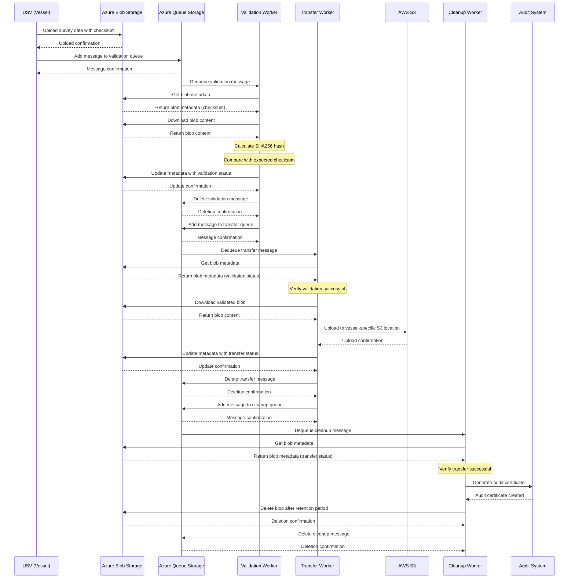

```mermaid
sequenceDiagram
    participant USV as USV (Vessel)
    participant Blob as Azure Blob Storage
    participant Queue as Azure Queue Storage
    participant ValWorker as Validation Worker
    participant TransWorker as Transfer Worker
    participant S3 as AWS S3
    participant CleanWorker as Cleanup Worker
    participant Audit as Audit System

    %% Initial upload from USV
    USV->>Blob: Upload survey data with checksum
    Blob-->>USV: Upload confirmation
    USV->>Queue: Add message to validation queue
    Queue-->>USV: Message confirmation

    %% Validation worker process
    Queue->>ValWorker: Dequeue validation message
    ValWorker->>Blob: Get blob metadata
    Blob-->>ValWorker: Return blob metadata (checksum)
    ValWorker->>Blob: Download blob content
    Blob-->>ValWorker: Return blob content
    Note over ValWorker: Calculate SHA256 hash
    Note over ValWorker: Compare with expected checksum
    ValWorker->>Blob: Update metadata with validation status
    Blob-->>ValWorker: Update confirmation
    ValWorker->>Queue: Delete validation message
    Queue-->>ValWorker: Deletion confirmation
    ValWorker->>Queue: Add message to transfer queue
    Queue-->>ValWorker: Message confirmation

    %% Transfer worker process
    Queue->>TransWorker: Dequeue transfer message
    TransWorker->>Blob: Get blob metadata
    Blob-->>TransWorker: Return blob metadata (validation status)
    Note over TransWorker: Verify validation successful
    TransWorker->>Blob: Download validated blob
    Blob-->>TransWorker: Return blob content
    TransWorker->>S3: Upload to vessel-specific S3 location
    S3-->>TransWorker: Upload confirmation
    TransWorker->>Blob: Update metadata with transfer status
    Blob-->>TransWorker: Update confirmation
    TransWorker->>Queue: Delete transfer message
    Queue-->>TransWorker: Deletion confirmation
    TransWorker->>Queue: Add message to cleanup queue
    Queue-->>TransWorker: Message confirmation

    %% Cleanup worker process
    Queue->>CleanWorker: Dequeue cleanup message
    CleanWorker->>Blob: Get blob metadata
    Blob-->>CleanWorker: Return blob metadata (transfer status)
    Note over CleanWorker: Verify transfer successful
    CleanWorker->>Audit: Generate audit certificate
    Audit-->>CleanWorker: Audit certificate created
    CleanWorker->>Blob: Delete blob after retention period
    Blob-->>CleanWorker: Deletion confirmation
    CleanWorker->>Queue: Delete cleanup message
    Queue-->>CleanWorker: Deletion confirmation
```